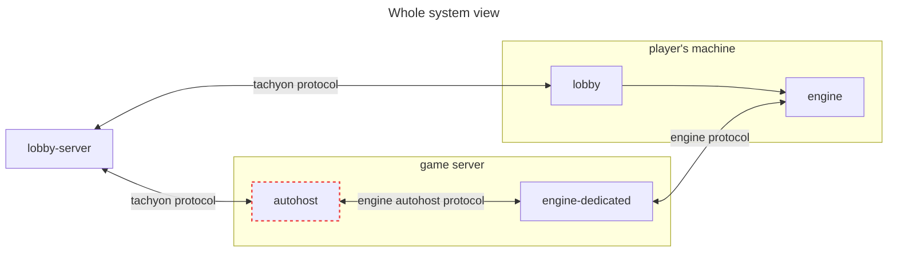

# Recoil Autohost

Starts [Recoil] engine dedicated game servers as-a-service over the [Tachyon] protocol.



## Overview

This repo contain the Autohost service as defined in the [Tachyon] protocol
definition. The service connects to the configured lobby server endpoint and
allows lobby to start new battles. A single Autohost service can manage many
battles in parallel. The autohost then facilitates communication between the
running dedicated [Recoil] engine processes and lobby server (for example
[Teiserver]): messages, commands, game updates.

Currently the service implements fully the Tachyon Autohost endpoints but isn't
yet fully ready for production deployments.

## Usage

### Running Locally

Autohost takes a single JSON configuration file as argument and starts the
operation:

```shell
npm install
npm run start config.json | npx pino-pretty
```

A minimal configuration file looks like:

<!-- prettier-ignore -->
```json
{
  "tachyonServer": "lobby-server.example.com",
  "authClientId": "autohost1",
  "authClientSecret": "pass1",
  "hostingIP": "123.123.123.123"
}
```

To see all options take a look at schema in [`src/config.ts`](./src/config.ts).

### Running with Docker

For production deployments, we recommend using Docker. See the [Docker Build Documentation](./docker-build/README.md) for detailed information about building and running the container.

Quick start with Docker:
```bash
# Build the image
./docker-build/build.sh

# Run the container
./docker-build/run.sh -c config.json
```

### Testing

For testing and development, we provide a test case environment that includes a mock Tachyon server. See the [Test Case Documentation](./testcase/README.md) for detailed information about running tests and example usage.

Quick test start:
```bash
# Run the test case
./testcase/testcase_run.sh -debug
```

## Directory Structure

Autohost expects the following directory structure:

```
.
├── config.json
├── engines/
│   └── [engine binaries]
└── instances/
    └── [battle instances]
```

For example:
```console
$ tree engines -L 1
engines
├── 105.1.1-2590-gb9462a0 BAR105
└── local -> ../../spring/build-linux/install
```

During execution, autohost creates a new directory for each started battle
under `instances` directory, for example `instances/5a7b1354-e3ff-4a98-946e-9bece3b869a3/`.

## Development

### Git hooks

It is recommended to set up a simple [Git pre-commit hook](https://git-scm.com/book/ms/v2/Customizing-Git-Git-Hooks)
provided in the repo ([`pre-commit`](./pre-commit)) that runs automatic checks
on changes in every new commit: formatting type-checking, tests, linting.

```shell
ln -s ../../pre-commit .git/hooks/pre-commit
```

### Testing with tachyon server fake

This repository contains a minimal bare bones implementation of Tachyon lobby
server: [`src/tachyonServer.fake.ts`](./src/tachyonServer.fake.ts) that can be
used to test full end to end behavior of autohost without running real server.

To start the service run

```
npm run start-tachyon-fake | npx pino-pretty
```

The service will listen for autohost on port 8084 and [`config.dev.json`](./config.dev.json)
contains the config that will make autohost connect to it:

```
npm run start config.dev.json | npx pino-pretty
```

The fake prints all tachyon messages it receives and sends JSON messages it
gets via HTTP to the connected autohost. See the [Test Case Documentation](./testcase/README.md) for an example session showing how to use the fake server.

[Recoil]: https://github.com/beyond-all-reason/spring
[Tachyon]: https://github.com/beyond-all-reason/tachyon
[Teiserver]: https://github.com/beyond-all-reason/teiserver
